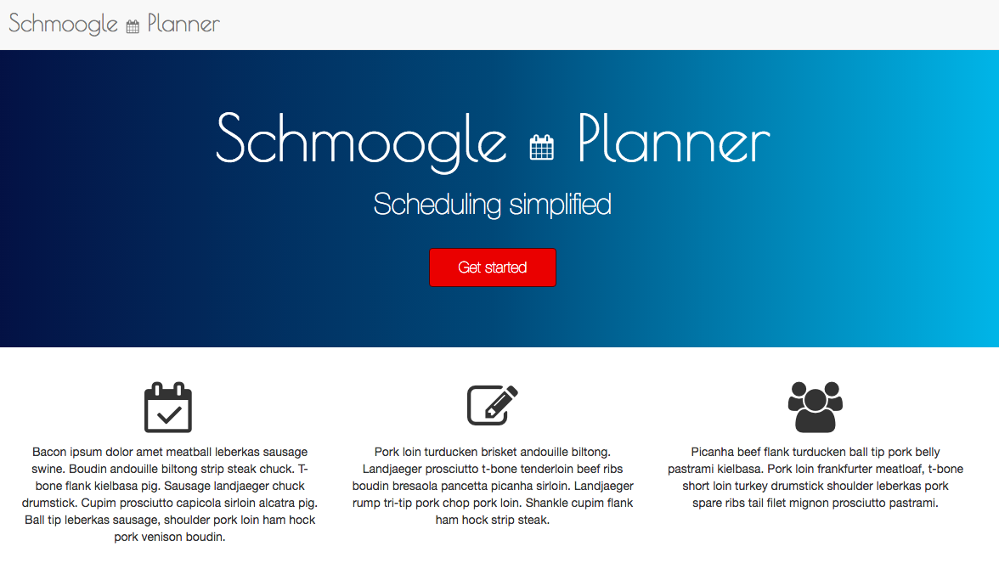
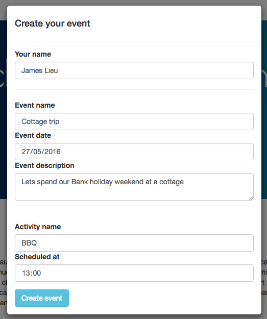
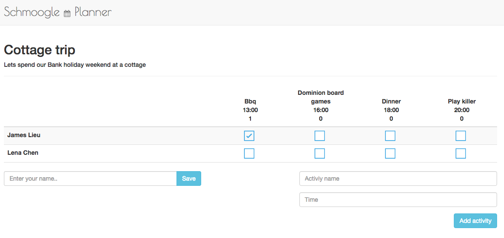

## Schmoogle planner
http://schmoogle.herokuapp.com/

My very own doodle planner project.

This project was initially built because I needed to plan a birthday party where some
participants were only able to attend on certain parts of the day, also chasing what times they're
available can be difficult to keep track of
(especially if they're indecisive or is unable to respond immediately)

I saw this as an opportunity to build something using ReactJS and Ruby on Rails

